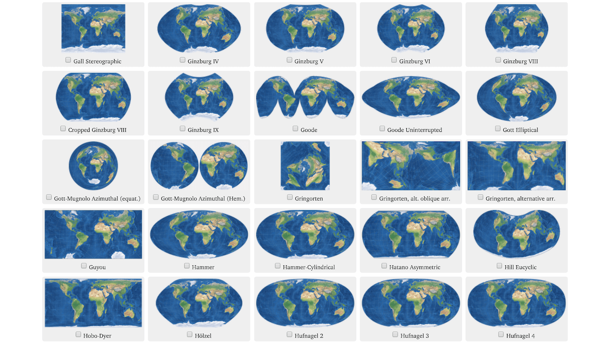

```{r setup, include=FALSE}
knitr::opts_chunk$set(echo = TRUE,warning=FALSE,message=FALSE)

#install.packages("sf")
library(sf)
#install.packages("mapview")
library(mapview)
#install.packages("dplyr")
library(dplyr)
#install.packages("leaflet")
library(leaflet)
#install.packages("measurements")
library(measurements)
#install.packages("readr")
library(readr)
#install.packages("ggplot2")
library(ggplot2)
```

## Introduction

This walkthrough covers some of the same concepts from Jamie Montgomery's [guide](https://github.com/jamiecmontgomery/spatial-analysis-R) on spatial data in R, which is how I first learned to use the `sf` package. It will cover some of the same concepts and also some different ones.

As her guide does, I will start with background from the [sf](https://cran.r-project.org/web/packages/sf/vignettes/sf1.html) vignette: 

>Simple features or simple feature access refers to a formal standard (ISO 19125-1:2004) that describes how objects in the real world can be represented in computers, with emphasis on the spatial geometry of these objects. It also describes how such objects can be stored in and retrieved from databases, and which geometrical operations should be defined for them.

>The standard is widely implemented in spatial databases (such as PostGIS), commercial GIS (e.g., ESRI ArcGIS) and forms the vector data basis for libraries such as GDAL. A subset of simple features forms the GeoJSON standard.

>R has well-supported classes for storing spatial data (sp) and interfacing to the above mentioned environments (rgdal, rgeos), but has so far lacked a complete implementation of simple features, making conversions at times convoluted, inefficient or incomplete. The package sf tries to fill this gap, and aims at succeeding sp in the long term.

## Reading in shapefiles and basic operations

We will read in a shapefile of wildfire perimeters from the US Geological Survey (USGS) [Monitoring Trends in Burn Severity](https://www.mtbs.gov/) (MTBS) dataset. The data contained in this repo are for California wildfires from 2010 through 2016.

```{r read in shapefile}
fire_perims <-
  read_sf("data/fire_perims/mtbs_perims_DD.shp")
```

Taking a look at the data:

```{r head data}
head(fire_perims)
```

An `sf` object is similar to a dataframe except that it has an additional column, the geometry column, which contains a list of coordinates used to plot each polygon.

```{r class of sf}
class(fire_perims)
```

Visualizing the data spatially using `mapview`.

```{r mapview fire perims}
mapview(fire_perims,col.regions = "orange")
```

Occasionally I do not care about the spatial parts of a shapefile and I only want to recover the attributes. In the `sf` environment one can easily convert to a dataframe and de-select the spatial components.

```{r coerce to df}
fire_df <-
  data.frame(fire_perims) %>%
  select(-geometry)
head(fire_df)
```

I could potentially take the above dataframe elsewhere, write it to a csv, and use it for something else. Another quick way to drop the geometry:

```{r drop geometry}
fire_df <-
  st_drop_geometry(fire_perims)
```

Suppose we would like to know what kinds of fires there are in the data field `Fire_Type`. 

```{r distinct fire types}
fire_df %>% 
  distinct(Fire_Type)
```

Perhaps we are unconcerned with "RX" fires, which are prescribed burns. We can remove them from our `sf` object using `dplyr::filter`.

```{r filter prescribed burns}
fire_perims <-
  fire_perims %>%
  filter(Fire_Type != "RX")
```

This dropped a small number of observations.

## Choosing a coordinate reference system

Another important feature of any spatial file is the coordinate reference system (CRS). I will once again reference Jamie Montgomery's concise explanation of coordinate reference systems:

>Every sf object needs a coordinate reference system (or crs) defined in order to work with it correctly. A coordinate reference system contains both a datum and a projection. The datum is how you georeference your points (in 3 dimensions!) onto a spheroid. The projection is how these points are mathematically transformed to represent the georeferenced point on a flat piece of paper. All coordinate reference systems require a datum. However, some coordinate reference systems are “unprojected” (also called geographic coordinate systems). Coordinates in latitude/longitude use a geographic (unprojected) coordinate system.

We can retrieve the coordinate reference system of our `sf` object using `sf::st_crs`.

```{r crs}
st_crs(fire_perims)
```

By the output we see that the coordinates are unprojected and are instead in lat-long format. We can confirm this with a simple function.

```{r is lat long}
st_is_longlat(fire_perims)
```

To make full use of `sf`'s distance and area calculations you need a flat projection. `sf::st_is_longlat` is a good sanity check if you are unsure why your distance and area calculations are not working.

What projection is best? A flat projection affects the aesthetics of a map, but it also will affect our distance calculations.


<center> 
Image ©Tobias Jung CC BY-SA 4.0.
</center> 
<br>

California generally recommends to use the "California (Teale) Albers" projection. Every map projection is associated with an "EPSG" code, and the EPSG code for California Albers is 3310. We can project the data using `sf::st_transform`.

```{r crs california albers}
fire_proj <-
  fire_perims %>%
  st_transform(crs=3310)  # california albers

# checking:
st_crs(fire_proj)
```

We now have more information about the `sf` object, including the units of distance (which are in meters). 

## Measuring area

One simple calculation is an area measurement. Our dataset already gave us an "Acres" field, so we will see how closely our computation matches. The relevant function is `sf::st_area`.

```{r area measurement}
fire_proj <-
  fire_proj %>%
  mutate(area=st_area(fire_proj))

fire_proj %>%
  select(Acres,area) %>%
  head()
```

Whoops. We left the units in m^2. To easily convert to acres I like the function `measurements::conv_unit`.

```{r area conversion}
fire_proj <-
  fire_proj %>%
  mutate(area=as.numeric(st_area(fire_proj))) %>%
  mutate(area=conv_unit(area,from="m2",to="acre"))

fire_proj %>% 
  select(Acres,area) %>%
  head()
```

This is a very close match.

## Creating spatial data

Sometimes we have spatial information in a non-spatial data format. We will import some data on federally managed campgrounds from [Recreation.gov](https://recreation.gov).

```{r campground data import}
campgrounds <-
  read_csv("data/recreation/campgrounds.csv")
head(campgrounds)
```

I suggest exploring that data a bit. The brochure descriptions are fun. Of course, the data is not yet in a spatial form.

```{r campground type}
class(campgrounds)
```

In fact, the lat/long coordinates are a numeric class:

```{r lat long data type}
class(campgrounds$facility_latitude)
```

To coerce to a spatial format, we can use the function `sf::st_as_sf`. 

```{r spatial coercion}
campground_sf <-
  st_as_sf(
    campgrounds,
    coords = c("facility_longitude","facility_latitude"),
    crs=4269,  # to maintain consistency with our fire data (NAD83)
    remove=F  # else it removes the original lat-long columns
  )
```

We can now view the campgrounds on the map:

```{r mapview campgrounds}
mapview(campground_sf)
```

That is a lot of points to look at. Let us restrict only to National Parks sites in California, even though this leaves out potentially interesting locations like Lake Tahoe and Big Bear. 

```{r mapview nps in ca}
ca_nps <- 
  campground_sf %>% 
  filter(state_code=="CA" & agency_name=="NPS")
  
mapview(ca_nps)
```

That looks more manageable for our analysis -- only 61 campgrounds. Writing as a shapefile:

```{r write shapefile}
write_sf(ca_nps,"output/ca_nps.shp")
```

It is straightforward to generate any dataset of points of interest simply by knowing the lat-long coordinates, which can be scraped from sources like the Google Maps API.

## Drawing buffers

For various purposes we often need to draw buffers around spatial objects. For example, one may not be concerned with only a river, but also with a 10 meter buffer around it. 

As mentioned earlier, to specify distances we need to use flat projections. We can again project our campgrounds data using `sf::st_transform`. Then we will use `sf::st_buffer` to draw buffers. Recall that the default measurement for flat projections is in meters. If we wanted to draw, say, 30 km buffers then this would translate to 30,000 meters.

```{r project campgrounds}
# project
ca_nps_proj <-
  ca_nps %>%
  st_transform(crs=3310)  # california albers

# drawing buffers
ca_nps_buffer <-
  ca_nps_proj %>%
  st_buffer(30000)  # 30 km buffers

mapview(ca_nps_buffer)
```

Note that we have turned our points into polygons. 

## Intersections

We can test intersections of objects. Consider the question, "How many national parks campgrounds were within 30 km of a wildfire from 2010 to 2016?" One way (among numerous) to answer that question is to see if our buffered sites intersect with wildfire perimeters. First we look at the data:

```{r buffers and fires}
mapview(ca_nps_buffer) +
  mapview(fire_proj,col.regions="orange")
```

Visually there are many intersections. To identify which campgrounds were within 30 km of which fires, we will use our projected data as well as `sf::st_intersects`.

```{r test intersections}
fire_intersects <-
  st_intersects(ca_nps_buffer,fire_proj)
```

This creates a listed data structure showing, for each of our 61 California National Parks sites, the index number of the fire that overlapped with it. For example, our first `ca_nps_buffer` entry, the Wawona campground in Yosemite, was affected by nine different fires, including fire number 144, the Rim Fire.

Two ways to make this data structure more convenient to work with: convert to a matrix or convert to a key-value format.

```{r transform listed data}
# a matrix
fire_intersects_matrix <- 
  as.matrix(fire_intersects)

# a key-value format
fire_intersects_df <- 
  data.frame(fire_intersects)
```

Using either format one could back out meaningful information, such as the number of wildfires that were within 30 km of Yosemite National Park sites from 2010-2016.

## Measuring distance

We can measure the distance of our spatial objects from each other. For each of our 61 campgrounds, how far were they from each of the 247 fires? We will return a matrix of dimensions 61 by 247 using `sf::st_distance`. Since our projected data are in meters, the answer will be in meters.

```{r distance}
fire_dist <-
  st_distance(ca_nps_proj,fire_proj)
```

To make the data more accessible, we should wrap it in `data.frame`.

```{r data.frame distance}
# a data frame for campground distance to fire
fire_dist <-
  data.frame(
    st_distance(ca_nps_proj,fire_proj)
  )

# lapply to make them numeric values
# coerce to numeric
fire_dist[] <-
  lapply(fire_dist,as.numeric)
```

So for campground $i$ and fire $j$, the $(i,j)$th position gives the distance of that campground to the given fire.

## Testing if objects contain one another

Wildfires also generate smoke. One source of spatial wildfire smoke data is the National Oceanic and Atmospheric Administration (NOAA) Hazard Mapping System (HMS) smoke product. Drawn from satellite images, this product gives daily shapefiles for wildfire smoke extent. We will read in the shapefile for August 19, 2015 and restrict our fires to those that began in the summer of 2015.^[I have previously modified the NOAA HMS shapefile for August 19, 2015 to restrict attention to California plumes.]

```{r import smoke data}
# read smoke data
smoke <- 
  read_sf("data/smoke/hms_smoke20150819.shp",
          crs=4269)  # we can specify the CRS (NAD83) as we read it in

# california wildfires from summer 2015
fire_2015 <-
  fire_perims %>%
  filter(Year==2015 & StartMonth %in% 6:8)

# mapping
mapview(ca_nps) +
  mapview(smoke,col.regions="lightgrey") +
  mapview(fire_2015,col.regions="orange")
```

On this day many campgrounds were beneath wildfire plumes. We can derive an exact answer using `sf::st_within`. For the 61 campgrounds and 15 smoke plumes, we will have an object of dimension 61 by 15. 

First we need to project our smoke data.

```{r st within}
# projected smoke
smoke_proj <-
  smoke %>%
  st_transform(crs=3310)  # california albers

# testing campgrounds within smoke
campgrounds_within <-
  st_within(ca_nps_proj,smoke_proj)
```

We again have a listed object where the row $i$ corresponds to a campground and the list gives the index numbers $j$ of the smoke plumes covering a given $i$. Like before, we can either convert the listed object to a matrix or a key-value dataframe.

```{r smoke matrix}
# a matrix
campgrounds_win_matrix <-
  as.matrix(campgrounds_within)

# a key-value dataframe
campgrounds_win_df <-
  data.frame(campgrounds_within)
```

## Making a static map

We have used `mapview` throughout this guide, but it is also straightforward to make static maps using language from `ggplot`.

```{r ggplot}
# import california shapefile
ca <- 
  read_sf("data/state/california2016.shp")

# project
ca_proj <-
  ca %>%
  st_transform(crs=3310)

p <-
  ggplot() +
  geom_sf(data=ca_proj) +
  geom_sf(data=ca_nps_proj,color="darkgreen") +
  geom_sf(data=fire_proj,color="orange",fill="orange",alpha=0.5) +
  theme_bw()
p
```

To modify the map aesthetics (for example, get rid of the axis text) one can use familiar arguments in the `theme` command, such as the following:

```{r modify map}
p +
  theme(axis.text=element_blank(),
        axis.ticks=element_blank())
```

... and much more.

## Conclusion

There is much more to do with the `sf` package. A large part of the syntax is drawn from `gdal` functions, so it is generally easy to teach oneself to do new things because so much documentation exists. 

One thing I did not cover in depth was how to make maps. There are many useful data visualization techniques such as filling polygons based on data values. For that I would again defer to Jamie Montgomery's [guide](https://github.com/jamiecmontgomery/spatial-analysis-R) on `sf`.